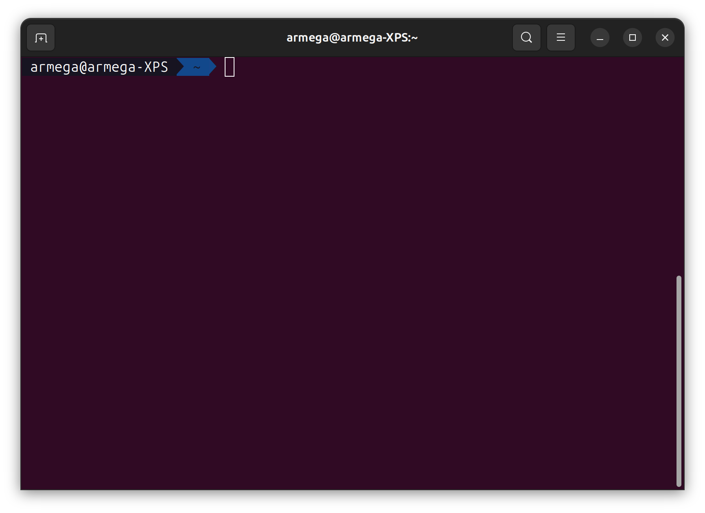
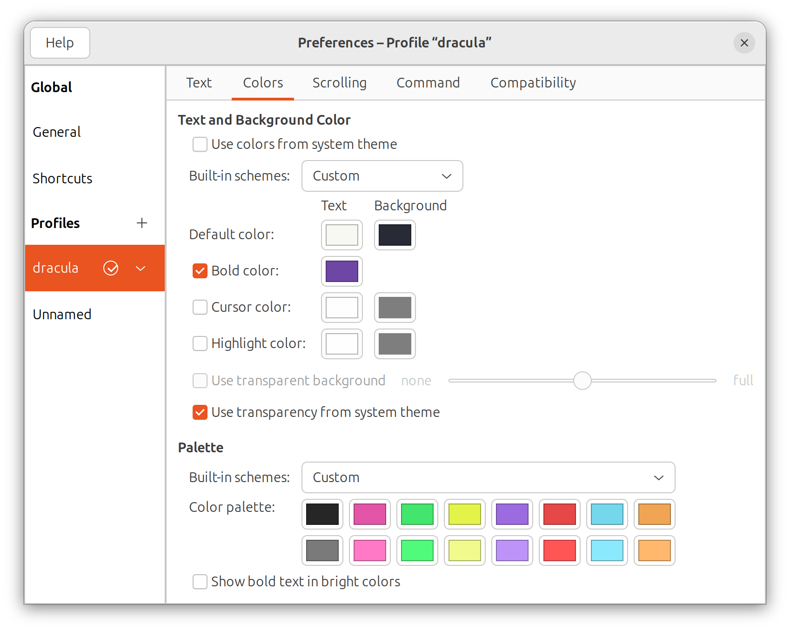
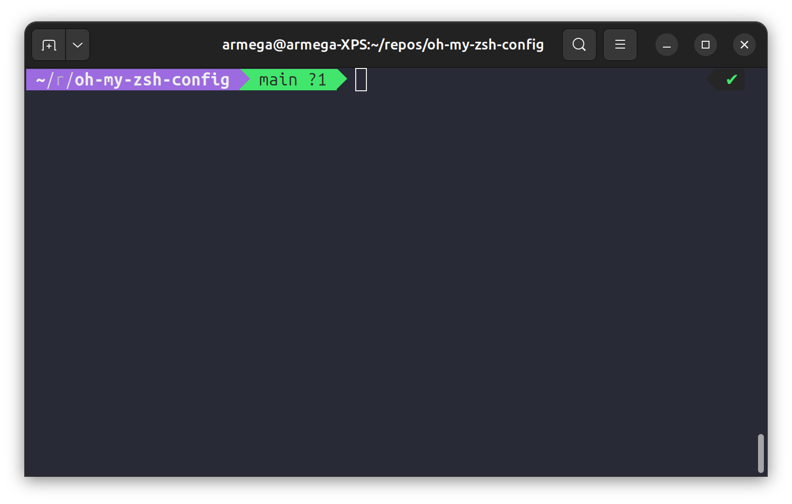

# Instalación zsh
Para instalar **zsh**:
```bash
sudo apt update
sudo apt install zsh
zsh --version
```
Configuramos y establecemos por defecto zsh lanza el comando:
```bash
zsh (opción 2)
chsh -s $(which zsh)
```
Hay que cambiar el theme e instalar el siguiente paquete:
```bash
ZSH_THEME="agnoster"
sudo apt-get install fonts-powerline
```

Instalamos **oh-my-zsh**:
```bash
sh -c "$(wget https://raw.githubusercontent.com/ohmyzsh/ohmyzsh/master/tools/install.sh -O -)"
```

# Powerlevel10k y dracula theme
Instalamos **powerlevel10k**, lo ponemos como theme por defecto y lo configuramos:
```bash
git clone --depth=1 https://github.com/romkatv/powerlevel10k.git ${ZSH_CUSTOM:-$HOME/.oh-my-zsh/custom}/themes/powerlevel10k

ZSH_THEME="powerlevel10k/powerlevel10k"

p10k configure
```
Instalamos el theme de **dracula**:
```bash
sudo apt-get install dconf-cli
```
Clonamos el repositorio y accedemos al directorio:
```bash
git clone https://github.com/dracula/gnome-terminal
cd gnome-terminal
```
Creamos un perfil en las preferencias de la terminal llamado **dracula**:

Lanzamos el script de instalación:
```bash
./install.sh
```
Después marcamos por defecto el perfil drácula.

# Plugins
Instalamos la siguiente [fuente](https://github.com/ryanoasis/nerd-fonts/releases/download/v3.2.1/0xProto.zip)
Instalamos **ruby**:
```bash
sudo apt-get install ruby
sudo apt-get install ruby-dev
gem install colorls
```
```bash
git clone https://github.com/zsh-users/zsh-autosuggestions.git $ZSH_CUSTOM/plugins/zsh-autosuggestions

git clone https://github.com/zsh-users/zsh-syntax-highlighting.git $ZSH_CUSTOM/plugins/zsh-syntax-highlighting

git clone https://github.com/zsh-users/zsh-syntax-highlighting.git $ZSH_CUSTOM/plugins/common-aliases

git clone https://github.com/zsh-users/zsh-syntax-highlighting.git $ZSH_CUSTOM/plugins/colored-man-pages

git clone https://github.com/zsh-users/zsh-syntax-highlighting.git $ZSH_CUSTOM/plugins/zsh-colorls

git clone https://github.com/zsh-users/zsh-syntax-highlighting.git $ZSH_CUSTOM/plugins/git
```
Así es como se debería ver la terminal:

# .zshrc
Este es mi archivo de configuración que estoy utilizando actualmente:
```bash
# Enable Powerlevel10k instant prompt. Should stay close to the top of ~/.zshrc.
# Initialization code that may require console input (password prompts, [y/n]
# confirmations, etc.) must go above this block; everything else may go below.
if [[ -r "${XDG_CACHE_HOME:-$HOME/.cache}/p10k-instant-prompt-${(%):-%n}.zsh" ]]; then
  source "${XDG_CACHE_HOME:-$HOME/.cache}/p10k-instant-prompt-${(%):-%n}.zsh"
fi

# If you come from bash you might have to change your $PATH.
# export PATH=$HOME/bin:$HOME/.local/bin:/usr/local/bin:$PATH

# Path to your Oh My Zsh installation.
export ZSH="$HOME/.oh-my-zsh"

# Set name of the theme to load --- if set to "random", it will
# load a random theme each time Oh My Zsh is loaded, in which case,
# to know which specific one was loaded, run: echo $RANDOM_THEME
# See https://github.com/ohmyzsh/ohmyzsh/wiki/Themes
ZSH_THEME="powerlevel10k/powerlevel10k"
POWERLEVEL9K_MODE="nerdfont-complete"

# Set list of themes to pick from when loading at random
# Setting this variable when ZSH_THEME=random will cause zsh to load
# a theme from this variable instead of looking in $ZSH/themes/
# If set to an empty array, this variable will have no effect.
# ZSH_THEME_RANDOM_CANDIDATES=( "robbyrussell" "agnoster" )

# Uncomment the following line to use case-sensitive completion.
# CASE_SENSITIVE="true"

# Uncomment the following line to use hyphen-insensitive completion.
# Case-sensitive completion must be off. _ and - will be interchangeable.
# HYPHEN_INSENSITIVE="true"

# Uncomment one of the following lines to change the auto-update behavior
# zstyle ':omz:update' mode disabled  # disable automatic updates
# zstyle ':omz:update' mode auto      # update automatically without asking
# zstyle ':omz:update' mode reminder  # just remind me to update when it's time

# Uncomment the following line to change how often to auto-update (in days).
# zstyle ':omz:update' frequency 13

# Uncomment the following line if pasting URLs and other text is messed up.
# DISABLE_MAGIC_FUNCTIONS="true"

# Uncomment the following line to disable colors in ls.
# DISABLE_LS_COLORS="true"

# Uncomment the following line to disable auto-setting terminal title.
# DISABLE_AUTO_TITLE="true"

# Uncomment the following line to enable command auto-correction.
# ENABLE_CORRECTION="true"

# Uncomment the following line to display red dots whilst waiting for completion.
# You can also set it to another string to have that shown instead of the default red dots.
# e.g. COMPLETION_WAITING_DOTS="%F{yellow}waiting...%f"
# Caution: this setting can cause issues with multiline prompts in zsh < 5.7.1 (see #5765)
# COMPLETION_WAITING_DOTS="true"

# Uncomment the following line if you want to disable marking untracked files
# under VCS as dirty. This makes repository status check for large repositories
# much, much faster.
# DISABLE_UNTRACKED_FILES_DIRTY="true"

# Uncomment the following line if you want to change the command execution time
# stamp shown in the history command output.
# You can set one of the optional three formats:
# "mm/dd/yyyy"|"dd.mm.yyyy"|"yyyy-mm-dd"
# or set a custom format using the strftime function format specifications,
# see 'man strftime' for details.
# HIST_STAMPS="mm/dd/yyyy"

# Would you like to use another custom folder than $ZSH/custom?
# ZSH_CUSTOM=/path/to/new-custom-folder

# Which plugins would you like to load?
# Standard plugins can be found in $ZSH/plugins/
# Custom plugins may be added to $ZSH_CUSTOM/plugins/
# Example format: plugins=(rails git textmate ruby lighthouse)
# Add wisely, as too many plugins slow down shell startup.
plugins=(
	git common-aliases colored-man-pages zsh-autosuggestions zsh-syntax-highlighting zsh-colorls
)

source $ZSH/oh-my-zsh.sh

# User configuration

# export MANPATH="/usr/local/man:$MANPATH"

# You may need to manually set your language environment
# export LANG=en_US.UTF-8

# Preferred editor for local and remote sessions
# if [[ -n $SSH_CONNECTION ]]; then
#   export EDITOR='vim'
# else
#   export EDITOR='mvim'
# fi

# Compilation flags
# export ARCHFLAGS="-arch x86_64"

# Set personal aliases, overriding those provided by Oh My Zsh libs,
# plugins, and themes. Aliases can be placed here, though Oh My Zsh
# users are encouraged to define aliases within a top-level file in
# the $ZSH_CUSTOM folder, with .zsh extension. Examples:
# - $ZSH_CUSTOM/aliases.zsh
# - $ZSH_CUSTOM/macos.zsh
# For a full list of active aliases, run `alias`.
#
# Example aliases
# alias zshconfig="mate ~/.zshrc"
# alias ohmyzsh="mate ~/.oh-my-zsh"

# To customize prompt, run `p10k configure` or edit ~/.p10k.zsh.
[[ ! -f ~/.p10k.zsh ]] || source ~/.p10k.zsh

typeset -g POWERLEVEL9K_INSTANT_PROMPT=off
source $(dirname $(gem which colorls))/tab_complete.sh
```
